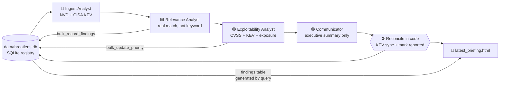
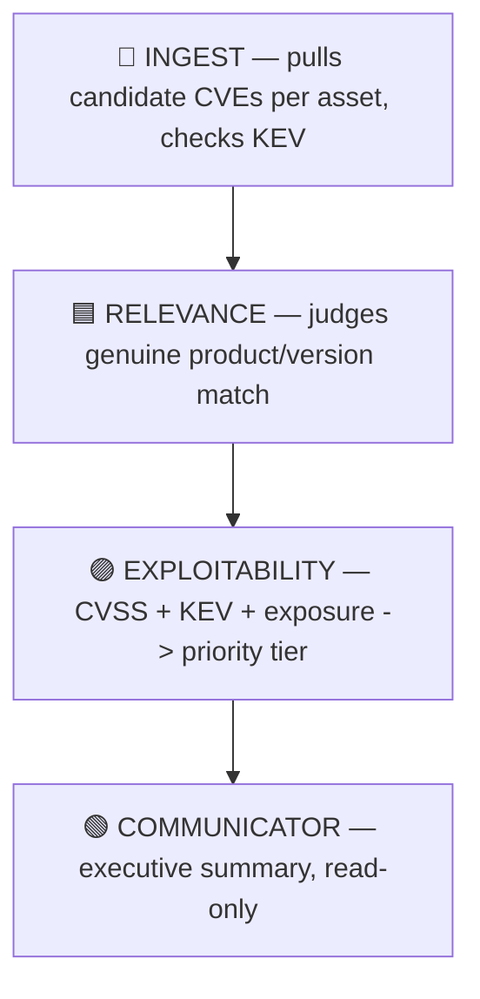

# Coverage_Crew

<p align="center">
  
  
  
  
  
  
  
  
  
</p>

<p align="center">
  <b>An agentic vulnerability-coverage console.</b><br/>
  A team of <b>4 AI agents</b> pulls today's CVEs for your tracked assets, judges
  genuine applicability (not just keyword matches), weighs real-world exploitability
  and exposure, and writes a dual-audience report — driven from the <b>CLI</b>
  or any <b>MCP client</b>, backed by a persistent local registry that grows every run.
  Every value with a single authoritative answer (CVSS, KEV membership, the findings
  table itself) comes from that source in code, not from the model.
</p>

```
You track assets   →   A team of AI agents works it   →   A prioritized report
name, vendor,           INGEST pulls CVEs + KEV ->           a code-generated findings
product, version,       RELEVANCE filters real matches ->    table, a full asset
exposure, criticality   EXPLOITABILITY scores urgency ->     inventory, and a plain-
                         COMMUNICATOR writes the summary     language exec summary
```

> ⚠️ **Findings require human verification before action.** This tool prioritizes
> what to look at first — it does not confirm exploitability, and CVE-to-asset
> matching is LLM judgment, not a guarantee. Treat every report as a starting
> point for investigation, not a final verdict.

---

## Contents

1. [What it is](#1-what-it-is)
2. [Architecture](#2-architecture)
3. [The agent team](#3-the-agent-team)
4. [Install](#4-install)
5. [Running](#5-running)
6. [The registry](#6-the-registry)
7. [The report](#7-the-report)
8. [The MCP server](#8-the-mcp-server)
9. [Configuration (env)](#9-configuration-env)
10. [Project structure](#10-project-structure)
11. [Troubleshooting](#11-troubleshooting)
12. [Safety model](#12-safety-model)
13. [License](#13-license)

---

## 1. What it is

Most teams don't have a ready-made feed telling them which of today's CVEs
actually apply to their own environment. Coverage_Crew builds and
maintains that visibility itself: you tell it what you run, and a CrewAI
team pulls recent CVEs, filters out the noise, scores real urgency, and
writes a report — all backed by a small SQLite registry that persists and
grows across runs.

**At a glance:** 4 agents · 4 pipeline stages · 11 tools · 2 data sources
(NVD, CISA KEV) · 2 front-ends (CLI / MCP) · 3 LLM providers (Ollama,
Anthropic, OpenAI).

### Division of labour

One rule shapes the whole design: **the LLM gets the judgment calls, and
nothing else.**

| Handled by the LLM (genuine judgment) | Handled in code (single authoritative answer) |
|---|---|
| Does this CVE actually apply to this asset? | CVSS score and severity — taken from NVD |
| How urgent is it, given exposure and criticality? | CISA KEV membership — read from the published catalog |
| What does a non-technical reader need to hear? | The complete findings table — generated by query |
| | Status bookkeeping (`prioritized` → `reported`) |

This split is not stylistic. It came out of testing against a local 8B
model, which — left to do the mechanical parts — produced inflated CVSS
scores, asserted KEV membership for CVEs not in the catalog, and on one
run reported "all systems are secure" while fifteen real findings sat in
the database. Each of those is now structurally impossible rather than
discouraged by prompting.

---

## 2. Architecture

```
1  INGEST ......... pull candidate CVEs per asset (NVD) + check active exploitation (CISA KEV)
2  RELEVANCE ...... judge genuine applicability (product + version match, not keyword match)
                     record via ONE bulk call; misattributed CVEs rejected at insert
3  EXPLOITABILITY . weigh CVSS + KEV + asset exposure/criticality into HIGH/MEDIUM/LOW
                     apply via ONE bulk call
4  COMMUNICATE ..... write the plain-language executive summary (read-only)
5  RECONCILE ....... [code, no LLM] sync KEV flags from CISA, mark findings reported,
                     render the findings table from the database
```

<details>
<summary>Pipeline as a Mermaid diagram</summary>


</details>

Stages 1–4 run sequentially as a CrewAI crew; stage 5 is plain Python in
the launcher, after `kickoff()` returns. Every agent's tools are plain
Python functions with no CrewAI import (`core/db.py`,
`tools/nvd_tools.py`, `tools/kev_tools.py`) — the same functions back
both the automated crew and the interactive MCP server, one
implementation, two front doors.

---

## 3. The agent team



| # | Agent | Core job | Tools |
|---|-------|----------|-------|
| 1 | **Threat Intel Ingest Analyst** | Pull candidate CVEs per asset (NVD), check CISA KEV for active exploitation | `list_assets`, `search_recent_cves`, `check_kev` |
| 2 | **Relevance Analyst** | Judge genuine applicability — product name and version range, not a keyword substring match | `list_assets`, `bulk_record_findings`, `record_finding` |
| 3 | **Exploitability & Exposure Analyst** | Weigh CVSS, KEV status, and the asset's own exposure/criticality into a HIGH/MEDIUM/LOW tier | `list_findings`, `bulk_update_priority`, `update_priority` |
| 4 | **Executive Communicator** | Write one short plain-language summary naming the 1–3 most urgent issues. Does not enumerate findings and does no bookkeeping | `list_findings` *(read-only)* |

Two deliberate choices in that table:

**Bulk tools are the preferred path.** Any agent that touches many
records gets a `bulk_*` tool carrying the whole batch in one call.
Asking a local model to issue the same tool call 15+ times in a row
reliably produces partial results — or narration of the calls instead of
execution.

**The Communicator is read-only, and that is the point.** It was
previously asked to enumerate every finding in prose *and* mark each one
reported. It did neither reliably: given 18 findings it wrote up 4 and
marked 2. Both jobs are now done in code, so the agent is left with the
one task it is genuinely good at — synthesising a short narrative — and
cannot silently drop records.

---

## 4. Install

**Prerequisites**
- **Python 3.10+**
- An **LLM** — a local **Ollama** instance (default, free) or an Anthropic/OpenAI API key
- No API key required for NVD or CISA KEV at light usage volumes

```bash
pip install -r requirements.txt
```

If you're running local Ollama, pull a tool-calling-capable model first —
every agent's entire job is calling tools, so this matters:

```bash
ollama pull qwen3:8b
```

**Verify the install:**
```bash
python -c "import crewai, fastmcp, markdown; print('deps OK')"
```

---

## 5. Running

Two front doors onto the same registry:

| Mode | How | When |
|------|-----|------|
| ⌨️ **CLI** | `python launchers/run_crew.py` | Run the full four-agent pipeline end-to-end and generate a report |
| 🤖 **MCP** | point an MCP client at `launchers/mcp_server.py` | Manage the registry conversationally — add assets, check status, mark findings reviewed |

**Run the full crew:**
```bash
# Local Ollama, default model (qwen3:8b)
python launchers/run_crew.py --seed-assets data/assets_seed.yaml

# Different local model — a one-flag change, no code edits
python launchers/run_crew.py --model qwen3:4b --seed-assets data/assets_seed.yaml

# Remote Ollama server
python launchers/run_crew.py --ollama-url http://192.168.1.50:11434

# Anthropic or OpenAI instead
python launchers/run_crew.py --provider anthropic --seed-assets data/assets_seed.yaml
python launchers/run_crew.py --provider openai --seed-assets data/assets_seed.yaml
```

Model resolution order: `--model` flag > `OLLAMA_MODEL`/`ANTHROPIC_MODEL`/`OPENAI_MODEL`
env var > built-in default. Drop `--seed-assets` on later runs — the
registry persists.

> **A note on Ollama context length:** set it in Ollama's own settings
> (or via a custom Modelfile), not through this project's CLI. A larger
> context window reserves more VRAM for the KV-cache; if that pushes
> generation off full GPU, runs get dramatically slower. Start at 8K and
> only raise it if you have GPU headroom to spare.

> **A note on Ollama idle unloading:** Ollama unloads a model from GPU
> memory after a short idle period (a few minutes by default). A gap
> between LLM calls longer than that — for example while `search_recent_cves`
> is waiting on a slow NVD response, or CrewAI is doing internal
> reasoning between tool calls — can trigger an unload mid-run. The
> *next* request then has to reload the entire model from disk before
> responding, which can look like the crew is "stuck" for anywhere from
> 10 seconds to over a minute. Before a long run (many assets), set a
> longer keep-alive in the same terminal you'll launch the crew from:
> ```powershell
> $env:OLLAMA_KEEP_ALIVE = "30m"   # or "-1" to never unload during the session
> ```
> Run `ollama ps` mid-run if a stage seems to be taking unusually long —
> a status of `Stopping...` confirms the model is unloading right when
> you need it loaded.

---

## 6. The registry

A single, persistent, **append-only** SQLite database at
`data/threatlens.db`. `init_db()` uses `CREATE TABLE IF NOT EXISTS`, so
it's never wiped automatically — delete the file yourself to reset.

| Table | Holds | Integrity rules |
|-------|-------|------------------|
| `assets` | name, vendor, product, version, exposure, criticality | **Deduplicated by name** — re-running `--seed-assets` never creates duplicates |
| `findings` | CVE ID, relevance rationale, CVSS, KEV flag, priority tier, status | **Deduplicated on `(asset_id, cve_id)`**; **CVE IDs are format-validated** (`CVE-YYYY-NNNN`, 4+ digits); **CVE-to-asset attribution is verified against NVD's own description before insert**, rejecting a real CVE ID filed under the wrong product |

Three values are never trusted from the model once a finding exists:

- **CVSS and severity** are taken from NVD's own record for the CVE at
  insert time, overriding whatever number an agent supplied.
- **KEV membership** (`in_kev`) is corrected after every run against
  CISA's actual published catalog — a run has asserted "explicitly
  listed in CISA KEV" for CVEs that were not in the catalog at all.
- **Report status** (`prioritized` → `reported`) is set by a database
  query after the run, not by the Communicator calling a tool per
  finding — see [§7](#7-the-report).

All three fail safe: an NVD or CISA lookup failure leaves the existing
value untouched rather than clearing it.

Seed your own environment by editing `data/assets_seed.yaml` — 11
example assets ship with the project, each carrying a real, well-known
CVE so a first run has genuine findings to reason about.

---

## 7. The report

Every run writes `reports/latest_briefing.html` — a styled,
self-contained report with:

| Section | What it shows |
|---------|----------------|
| **Run summary** | Timestamp, provider, model |
| **Data Integrity Warning** *(conditional)* | Only appears if the narrative doesn't hold up — see below |
| **Verified Findings** | Every finding at MEDIUM+ priority, generated directly from the database. Source of truth — unconditional, and independent of anything the model wrote |
| **Stat cards** | Assets tracked, total/High/Medium/Low findings, KEV count |
| **Evaluated Assets** | Every tracked asset with its own findings breakdown |
| **Performance** | Wall-clock time per agent + total |
| **Token Usage** | Prompt/completion/total tokens, request count, and a rough $ cost estimate for Anthropic/OpenAI (always `local/free` for Ollama) |
| **Executive Summary** | The Communicator's output — a short plain-language narrative naming the 1–3 most urgent issues. It does not, and is instructed not to, enumerate every finding; the Verified Findings table above already does that completely |

The **Verified Findings table exists specifically because the narrative
cannot be trusted to be complete.** Asking the Communicator to
exhaustively list every finding in prose reliably produced partial
results — 4 of 18 named in one observed run, with no indication
anything was left out. Generating the table in code from a database
query makes completeness a property of the code, not a hope about the
model's behavior.

The **Data Integrity Warning** cross-checks the narrative in three
directions:

- **Fabrication** — the narrative references a CVE ID or Finding ID
  that doesn't exist anywhere in the registry.
- **False all-clear** — the narrative explicitly states that no
  findings exist ("No findings matched the criteria", "All systems are
  secure") while real MEDIUM+ findings are sitting in the database.
  Observed directly in testing, and treated as the most severe check:
  a security tool silently claiming safety when real findings exist is
  worse than any amount of over-reporting.
- **Wrong-asset attribution** — any mentioned CVE is re-verified
  against NVD's own description for that specific finding row (not
  just the CVE ID in general, since the same CVE can legitimately or
  erroneously appear against more than one asset).

Note what's deliberately absent: there is no check for "the narrative
didn't name every finding." Under the current design that's the
intended shape of a correct report — the Verified Findings table
carries completeness, the narrative carries synthesis.

The console output mirrors the Performance and Token Usage sections,
plus a **Ground Truth** block that reads the database directly —
independent of anything any agent claimed in its own final answer text
— and reports what the post-run KEV sync and reported-status reconcile
actually did (e.g. "Corrected 16 in_kev flag(s) against the real CISA
KEV catalog").

---

## 8. The MCP server

```bash
python launchers/mcp_server.py
```

Exposes the registry as **9 MCP tools**: `add_asset`, `list_assets`,
`search_cves`, `check_kev_status`, `record_finding`, `list_findings`,
`update_finding_priority`, `mark_finding_reviewed`, `whats_new`.

Claude Desktop config:
```json
{
  "mcpServers": {
    "coverage_crew": {
      "command": "python",
      "args": ["/absolute/path/to/launchers/mcp_server.py"]
    }
  }
}
```

Then, conversationally: *"Add an asset: nginx 1.18 on our
internet-facing proxy, high criticality."* / *"What's new since last
time?"* / *"Mark finding 12 as reviewed."*

---

## 9. Configuration (env)

| Variable | Default | Purpose |
|----------|---------|---------|
| `ANTHROPIC_API_KEY` / `OPENAI_API_KEY` | — | LLM key, only needed for those providers |
| `OLLAMA_MODEL` / `ANTHROPIC_MODEL` / `OPENAI_MODEL` | *(built-in default)* | Model override, lowest priority after `--model` |
| `OLLAMA_KEEP_ALIVE` | *(Ollama's own default, ~5m)* | How long Ollama keeps the model loaded in GPU memory when idle. Set to `30m` or `-1` before a long run to avoid mid-run reload stalls (see the note in §5) |
| `NVD_API_KEY` | — | Optional; raises the NVD rate limit for CVE search |

Copy `.env.example` to `.env` to set these automatically. Most usage
needs no env vars at all — the default provider is local Ollama.
`OLLAMA_KEEP_ALIVE` is read by Ollama itself, not by this project, so
set it in your shell before launching the crew rather than in `.env`.

---

## 10. Project structure

```
Coverage_Crew/
├── core/
│   ├── db.py                 asset + findings registry (SQLite, no CrewAI import)
│   ├── report.py              HTML report renderer + data-integrity guard
│   └── pricing.py             rough $ cost estimation for paid providers
├── tools/
│   ├── nvd_tools.py           NVD CVE search
│   ├── kev_tools.py           CISA KEV catalog + cache
│   └── crew_tools.py          CrewAI BaseTool wrappers around the above
├── agents/
│   └── agents.py              4 agent definitions
├── launchers/
│   ├── run_crew.py            CLI entry point, full pipeline, timing + usage tracking
│   └── mcp_server.py          MCP server, same registry, interactive use
├── data/
│   └── assets_seed.yaml       example asset registry seed (11 assets, real CVEs)
├── reports/
│   └── latest_briefing.html   output (generated)
└── requirements.txt
```

---

## 11. Troubleshooting

| Symptom | Cause / Fix |
|---------|-------------|
| Agent narrates a tool call instead of invoking it | Small local models sometimes describe what they'd record in text instead of calling the tool. Prefer the `bulk_*` tools (already the default path) and a larger model (`qwen3:8b` over `qwen3:4b`) if it persists. |
| Report shows a **Data Integrity Warning** banner | The narrative fabricated a CVE/Finding ID, claimed no findings exist while real ones do, or a mentioned CVE doesn't match its asset's product per NVD. Don't discard the report — the Verified Findings table above the banner is generated from the database and unaffected by whatever triggered the warning. |
| `--seed-assets` run twice shows the same asset count | Expected — asset seeding is idempotent, deduplicated by name. |
| Run takes far longer than expected | Check Ollama's context length setting; a larger window can push generation off GPU and slow runs dramatically. Try a smaller context or a smaller model. Also check `ollama ps` — a `Stopping...` status mid-run means the model unloaded from idle timeout; set `OLLAMA_KEEP_ALIVE` (see §5) before the next run. |
| `pip install` fails on `crewai[anthropic]` | Anthropic's native provider is a separate extra; install with `pip install "crewai[anthropic]"` explicitly if using `--provider anthropic`. |
| MCP client can't connect | Confirm `fastmcp` is installed in the same interpreter running `mcp_server.py`, and that the client config points at the correct absolute path. |

---

## 12. Safety model

- **Scope of judgment is explicit, not hidden.** The Relevance Analyst's
  rationale is stored alongside every finding — a human can always see
  *why* a CVE was judged applicable, not just that it was.
- **Facts with one right answer are never left to the model.** CVE ID
  format, CVSS/severity, and CISA KEV membership are all validated or
  sourced from authoritative data in code — an agent's assertion is
  never the final word on any of them.
- **A misattributed CVE is rejected before it's stored, not flagged
  after the fact.** Insertion re-verifies the CVE's own NVD description
  against the target asset's product; a confirmed mismatch is refused
  outright. A display-time check re-verifies again as a backstop for
  anything already in the registry.
- **Findings never silently duplicate or get lost.** Deduplication and
  explicit status transitions (`new` → `prioritized` → `reported`) are
  enforced at the database layer, not left to agent memory, and the
  `reported` transition itself is a database query rather than an
  agent calling a tool once per finding.
- **Completeness doesn't depend on the model remembering everything.**
  The Verified Findings table is generated by code, unconditionally —
  a narrative that only mentions 2 of 18 findings still ships next to
  a table showing all 18.
- **The report tells you when the narrative doesn't hold up.** The
  Data Integrity Warning checks for fabrication, wrong-asset
  attribution, and — the case treated most seriously — an explicit
  false "all clear" claim made while real findings exist.
- **A verification failure never causes a false rejection.** NVD or
  CISA being briefly unreachable is treated as "unverifiable", never
  as "confirmed wrong" — the alternative would silently drop or flag
  legitimate findings during an outage.
- **Nothing here confirms exploitability or takes remediation action.**
  This tool prioritizes what to investigate first; intensive testing and
  patching decisions stay a human responsibility.

---

## 13. License

MIT License

Copyright (c) 2026 Diego Padilla Z.

Permission is hereby granted, free of charge, to any person obtaining a copy
of this software and associated documentation files (the "Software"), to deal
in the Software without restriction, including without limitation the rights
to use, copy, modify, merge, publish, distribute, sublicense, and/or sell
copies of the Software, and to permit persons to whom the Software is
furnished to do so, subject to the following conditions:

The above copyright notice and this permission notice shall be included in all
copies or substantial portions of the Software.

THE SOFTWARE IS PROVIDED "AS IS", WITHOUT WARRANTY OF ANY KIND, EXPRESS OR
IMPLIED, INCLUDING BUT NOT LIMITED TO THE WARRANTIES OF MERCHANTABILITY,
FITNESS FOR A PARTICULAR PURPOSE AND NONINFRINGEMENT. IN NO EVENT SHALL THE
AUTHORS OR COPYRIGHT HOLDERS BE LIABLE FOR ANY CLAIM, DAMAGES OR OTHER
LIABILITY, WHETHER IN AN ACTION OF CONTRACT, TORT OR OTHERWISE, ARISING FROM,
OUT OF OR IN CONNECTION WITH THE SOFTWARE OR THE USE OR OTHER DEALINGS IN THE
SOFTWARE.

---

<p align="center">
  Made with ❤️ by <b>Diego Padilla Z.</b> for the SANS Coin, Course SEC598
</p>
